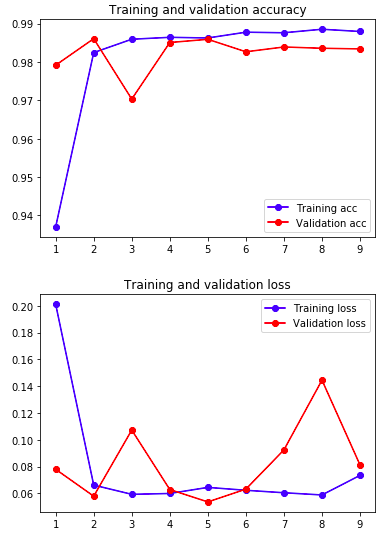
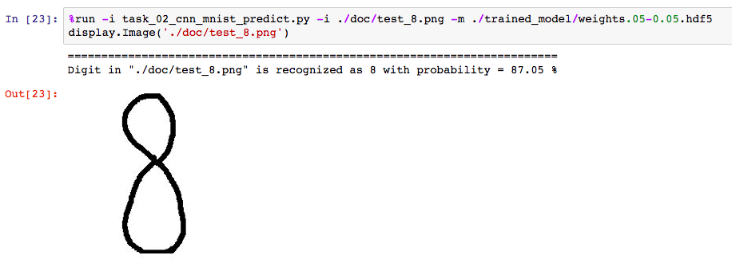
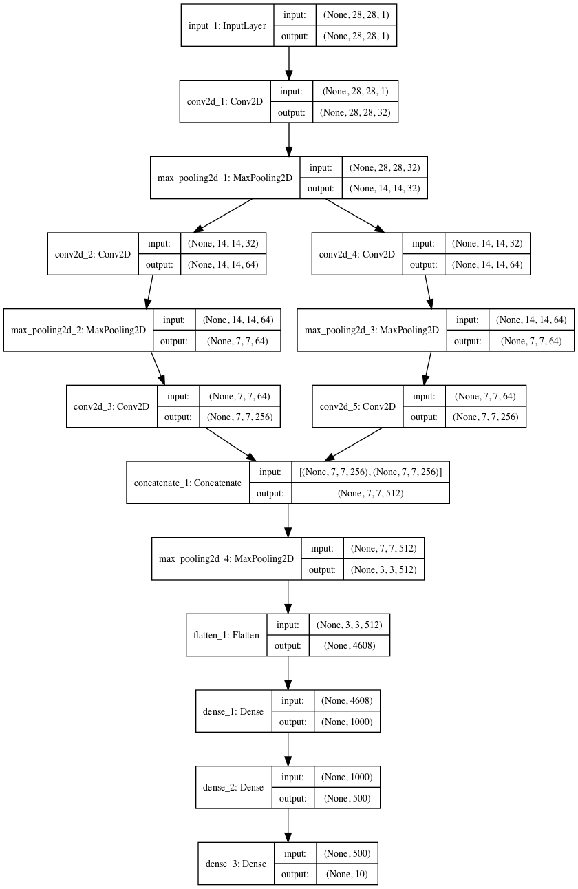

# CNNMnist

CNNMnist is a mini-project to apply convolutional neural network to [MNIST](http://yann.lecun.com/exdb/mnist/) dataset. The whole flow contains two parts: 

- Pipeline for model training: **task_01_cnn_mnist_pipeline.py**
- Script to classify an input image by a trained model: **task_02_cnn_mnist_predict.py**

# Usage

- Model training pipeline can be started by
  `task_01_cnn_mnist_pipeline.py -i <input_dataset_dir>`
- Classify the digit on an input image can done by
  `task_02_cnn_mnist_predict.py -i <input_image> -m <trained_model>`

Demonstration of the steps above can be found in *demo_task_01_cnn_mnist_pipeline.ipynb* and *demo_task_02_cnn_mnist_predict.ipynb.* Details about the model setup, modules of pipeline steps can be found in class [CNNMnist](https://github.com/chlin907/CNNMnist/tree/master/CNNMnist).

# Demo Result

Based on training history, we can conclude the model from epoch 5 is good for the purpose of this mini-project. 

Out best model perform quite consistently across training, validation and test sets without overfitting. 

| Dataset                  | Loss   | Accuracy |
| ------------------------ | ------ | -------- |
| **Training set (48k)**   | 0.0644 | 0.9863   |
| **Validation set (12k)** | 0.0536 | 0.9859   |
| **Test set (10k)**       | 0.0436 | 0.9874   |

Given a input image and our trained model, digit on the image is correctly predicted. 

# CNN Model

# Requirement

- Numpy
- Keras and Tensorflow
- Dataset [CNNMnist](https://github.com/chlin907/CNNMnist/tree/master/CNNMnist) You can run ./data/download_data.sh to download it.